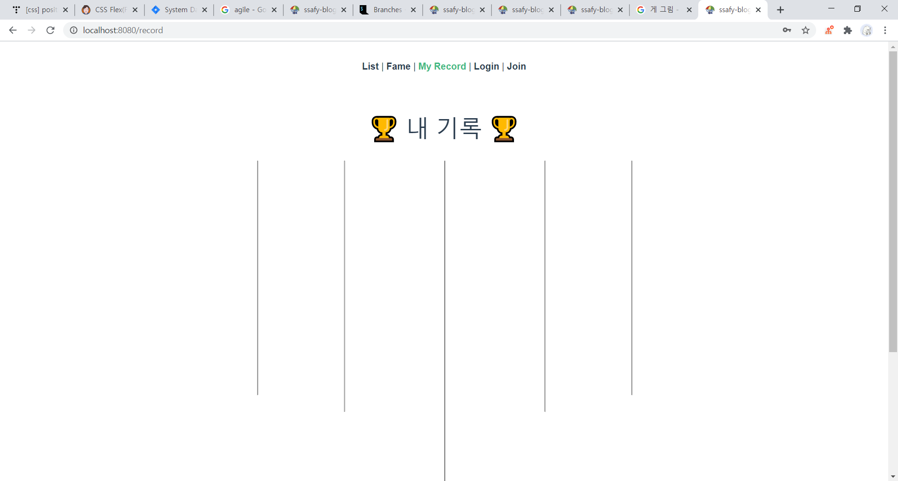
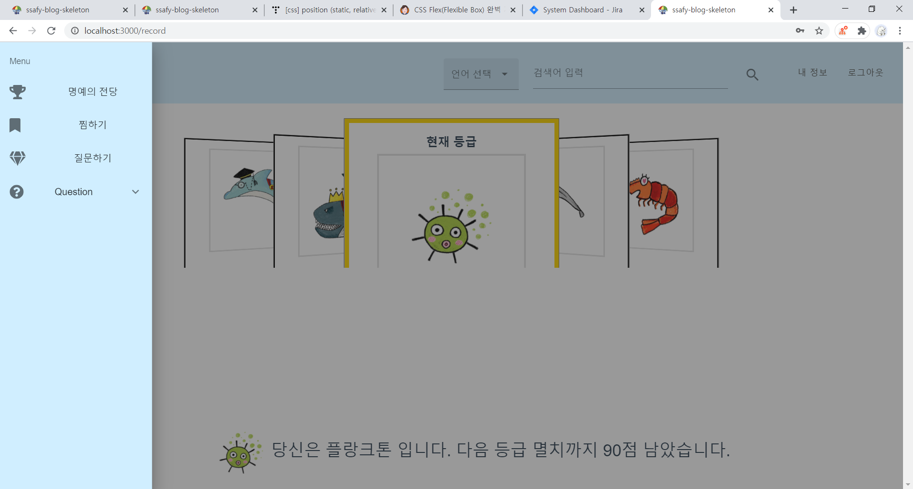

# SW 개발자 블로그

> 웹/모바일 기반 서비스 구현(웹 기술) 프로젝트


## 💻 프로젝트 목표

1. 기본 HTML, CSS, JavaScript(ES6)에 대한 이해
2. 웹 프로젝트 구성 이해
3. SPA(Single Page Application) 이해
4. Vue.js에 대한 이해
5. Java Spring Framework에 대한 이해
6. Responsive Web(반응형 웹) 이해
7. 사용자 친화적이고 다양한 디바이스에 최적화 된 웹 구현
8. 개성있는 기능 & 디자인 구현
9. 팀 프로젝트(개발 협업) 경험
10. 요구사항 및 데드라인에 맞춰서 개발


## 💻 프로젝트 개요

- Frontend: `Vue.js`의 전반적인 구조와 동작 방식을 이해하여 개발 => 컴포넌트 단위의 관리로 유지보수와 재사용성이 높음
- Backend: `Java Spring Boot`를 사용하여 유저 인증, 파일 업로드 등 다양한 기술을 구현
- Frontend와 Backend 간에는 REST API로 통신


## 💻 프로젝트 필수 지식

### 1. 웹 기초

1. HTML(Hyper Text Markup Language)
2. CSS(Cascading Style Sheets)
3. JavaScript

### 2. Vue.js

### 3. SPA

### 4. 반응형 웹

### 5. Java Spring Framework

### 6. MariaDB

### 7. Swagger

### 8. Docker

### 9. 그 외

- 프로젝트 일정 관리
  - 명세서 기반으로 지라 이슈 등록 및 스프린트 계획
- 협업 시 소통 방법
  - Daily Stand-up Meeting, 데일리 스크럼 미팅
- 병합 시 충돌 최소화 방법
  - 작은 Commit과 잦은 Merge Request로 코드를 자주 병합


## 💻 Sub PJT 1

### 목표

> 프론트엔드 및 벡엔드 기본
>
> 반응형 단일 페이지 애플리케이션 구현

1. 서비스의 이해
2. 개발 환경 구성
3. 개발 스펙 구성
4. 프론트엔드 기술의 이해
   - Vue.js
   - HTML
   - JavaScript(ES6)
5. 백엔드 기술의 이해
   - Java Spring
   - MariaDB
6. 로그인 및 회원가입 구현


## 💻 Sub PJT 2

### 목표

> 백엔드 구성 및 기본 기능 구현
>
> 블로그 주요 기능 구현

1. 블로그 포스팅 작성 기능 구현
2. 포스트 리스트 구현
3. 포스트 수정 및 삭제 구현
4. 태그 기능 구현
5. 좋아요 기능 구현


### 계획

- `REST API`

  > URL과 HTTP Request Method를 이용하여 통신의 역할을 명확히 규정짓는데 도움을 줌

  - Frontend로부터 Backend에 대한 요청을 처리하는 REST API를 구현함

- `AWS EC2`
  - Backend 자원을 AWS EC2 인스턴스에 올려 Frontend와 통신이 가능하게 함
  - Frontend와 Backend 모두 HTTP 통신으로부터의 에러와 소스코드상에서의 에러를 처리하는 예외처리 구문을 작성함

- DB

  1. `Java Spring`의 JPA를 활용하여 데이터베이스와의 통신을 구현
  2. 직접 Query문 작성

- `CSS/Sass`

  페이지 레이아웃


### 에러


## 💻 Sub PJT 3

### 목표

> 블로그 심화 기능 개발

1. 블로그 특화 에디터 기능 구현

   - 하나의 온전한 기능을 라이브러리 단위로 개발하기

   - 여러개의 컴포넌트와 기능으로 구성하기
2. 댓글 기능 구현
   - 내용 드래그
   - 코드 블록
3. 심화 기능 추가 구현
4. 배포


### 계획


### 에러

1. vue 3D carousel

- page를 처음 열었을 때 carousel이 세로 선으로 뜨고, 창을 최소화, 최대화 등을 해야 제대로 뜸

  

  - 에러 해결 시도

    - 다른 3d carousel => 똑같은 에러가 발생함

  - 에러 해결

    - 최상단 div에 있는 class="container"를 지우니 제대로 동작함

    

- nav바가 활성화되었을 때 carousel이 접힘

  

  - 에러 해결

    ```vue
    <carousel-3d style="height: 550px !important;">
    ...
    </carousel-3d>
    ```

  

## 💻 프로젝트 후기

### 프로젝트 후기

- commit 습관 개선

  - commit 규칙을 통해 효율적인 커밋 관리를 하게 됨

  - 메세지를 의미 없이 적거나 날짜를 적어왔는데 이런 습관을 고침

    > 날짜를 적을 필요가 없는 이유 => 커밋을 할 때 날짜 정보가 저장되므로 굳이 적을 필요가 없음; 자원 낭비임

  - 지라 이슈로 커밋을 함으로써 프로젝트를 더욱 효율적으로 관리함
  
  

### 팀 단위 개발 후기

- Jira & git flow 
- Agile
- 1학기 관통 프로젝트에서는 팀 단위 개발을 할 때 스스로 코딩 능력이 부족하다고 생각해서 많이 위축되어 있었다. 다른 팀원이 짜놓은 코드를 내가 망칠 것 같은 두려움에 API나 데이터 조작과 같이 메인 코드에 영향을 주지 않는 개발만 했다. 2학기 프로젝트가 시작되고 프로젝트를 할 때 더 이상 위축되어 있기 싫었다. 어차피 배우는 단계이므로 에러가 나는 상황을 두려워 하지 말자고 다짐했다. 프로젝트를 통해 개발 능력뿐만 아니라 자신감, 협업 능력 등 많은 것을 얻어가고 싶었고, 내 역량을 펼치고 싶었다. git과 jira를 통한 협업을 본격적으로 시작하면서 책임감이 생겼다. 

 


